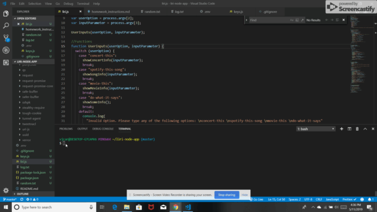

## liri-node-app

Creator: Valarie Cardoza

Created on: May 11 2019

# ABOUT THE APP

LIRI is a Language Interpretation and Recognition Interface. LIRI is a command line node app that takes in parameters and gives back data. The user has the option of using four commands (listed below) in conjuntion with specific parameters associated with the commands. The Commands are:

<li> concert-this </li>

<li> spotify-this-song </li>

<li> movie-this </li>

<li> do-what-it-says </li>

# HOW TO USE LIRI

<ul> Video Guide </ul>

# Instructions

Open your terminal such as Bash.  

Navigate to the folder that contains the liri.js file.  

Run the following outputs:  

<li>node liri.js concert-this</li>
<li>node liri.js spotify-this-song</li>
<li>node liri.js movie-this</li>
<li>node liri.js do-what-it-says</li>
